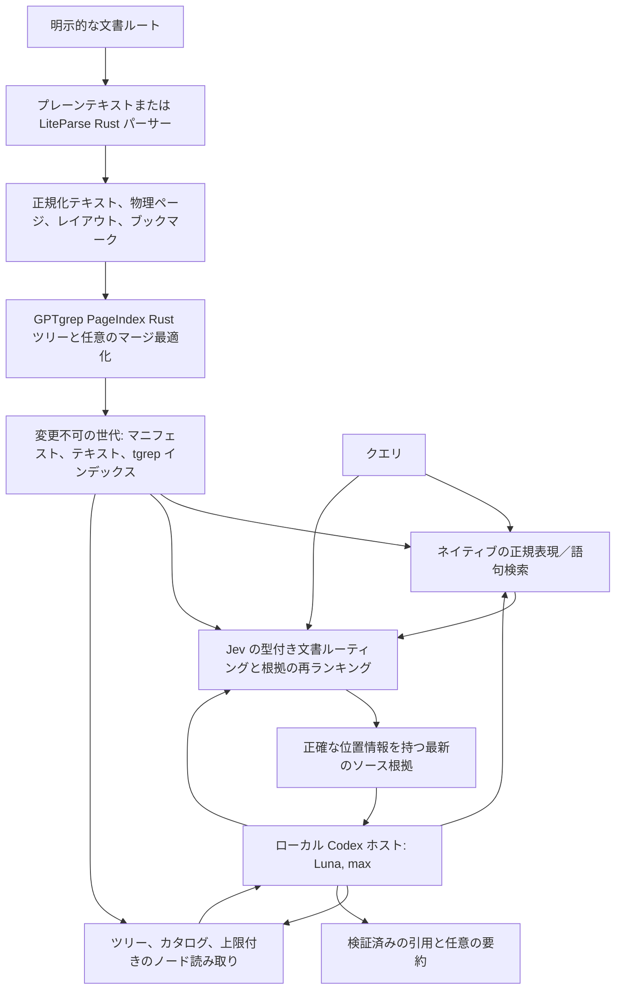

# GPTgrep アーキテクチャ

[English](architecture.md) | [简体中文](architecture.zh-CN.md) | [日本語](architecture.ja.md)

GPTgrep は、推論を行うエージェントがローカル文書へ高速にアクセスし、その根拠を確認できるように
します。厳密な検索、確率的な判断、モデルによる回答の生成を、それぞれ独立した操作として扱い、
別々の実行記録を残します。
デフォルトの検索とローカル推論ホストでは、Jev のルーティングと再ランキングを必須とします。
厳密検索の基本操作は、確認のために単独でも呼び出せます。

## モジュールの責務

| クレート／インターフェース | 責務 | 実行時の外部依存 |
| --- | --- | --- |
| `gptgrep-pageindex` | 純粋な Rust によるページ／セクション座標、見出し階層、ブックマーク統合、構造の最適化 | なし |
| `gptgrep-parse` | UTF-8 ソースの保持と、ソースリビジョンを固定した LiteParse 出力の変換 | ネイティブ文書には PDFium、Office 変換には LibreOffice |
| `gptgrep-index` | tgrep-core の組み込み、安全側に候補を残すトライグラム検索、Rust 正規表現による厳密な検証 | なし。デーモン不要 |
| `gptgrep-jev` | Choice/Noul/Score Decisions の通信、スキーマ検証、上限付きの推論 | 明示的な OpenRouter リクエスト |
| `gptgrep-core` | スナップショットの公開、ソースの鮮度、検索の組み合わせ、根拠の契約 | デフォルトの hybrid と semantic 検索では Jev が必須 |
| `gptgrep-host` | 上限付きのローカル Codex stdio app-server ワークフロー、ツールの振り分け、最終的な引用検証 | 呼び出し側が選択した Codex インストールとアカウント |
| `gptgrep-cli` | ネイティブの argv、JSON、スキーマ、grep 形式の表示 | ローカルコマンドには不要 |
| `packages/cli` | 任意の incur 表示・検出ラッパー | Node と公開済みの incur 0.5.1 |

このプロジェクトで選択されたホストプロファイルのデフォルトは、`model = "gpt-5.6-luna"` と
`model_reasoning_effort = "max"`、`service_tier = "fast"` です。これらはローカルヘルパーの設定であり、開発を担当する
エージェントのモデルは変更しません。実行時の `CODEX_HOME` により、既存のアカウント環境を選択
します。プログラムが認証ファイルを読み取ったりコピーしたり、グローバルプロファイルを変更したり、
対話的なログインを実行したりすることはありません。

## 取り込みとスナップショットの整合性

文書集合のルートは明示的に指定します。通常の無視ルールは Git リポジトリ外でも適用します。
隠しエントリ、Git／実行時／ビルド用ディレクトリ、認証情報用のファイル名、秘密鍵、シンボリック
リンク経由のソースエントリは除外されます。ソースパスは文書集合の内部に収まります。
ネイティブ解析は、すべての物理ページを処理しなければなりません。依存機能の不足、抽出エラー、
OCR が無効な状態でのテキストのないスキャン文書はエラーとして扱い、空文書の処理成功とは
みなしません。空のプレーンテキストは有効な文書ですが、根拠となる範囲はありません。

書き込み側は OS のファイルロックを保持します。`.gptgrep/generations/` の下に一意の世代を
作成し、ソースのバイト列を読み取ってハッシュを計算し、解析した後、ソースのダイジェストを
再検査します。正規化テキストと型付きのソースマニフェストを書き込み、トライグラムインデックスを
構築し、完全性を検証した上で、`CURRENT.json` をアトミックに公開します。構築に失敗した場合は、
以前のポインターを維持します。古い世代は保持し、インデックス操作の一部として自動削除は行いません。

ポインターは、マニフェストのダイジェストと世代を対応付けます。マニフェストは、正規化済みの
ルートパス、文書 ID、ソース／テキストのダイジェスト、パーサーの識別情報、ページ、ノードを
対応付けます。読み取り側は、識別情報の重複、不正な範囲や階層、互換性のないスキーマを拒否します。
インデックスアダプターも独立に、ファイルテーブルと候補テキストのダイジェストを対応付けます。
これらの検査は偶発的な破損を検出するためのものです。インデックスは、未知の第三者が提供した
ものの真正性を暗号学的に保証する形式ではありません。

ヒットの `source_fresh=true` は、その取得のために検査した時点で、元ソースのバイト列が記録済みの
ダイジェストと一致したことを意味します。選択されたソースは、リモート推論の後にもう一度検査
します。ファイルシステムの全エントリを直近に再検出したことまでは意味しません。`status` は既存の
インデックス済み文書を検証し、`index` は追加されたファイルを検出して、新しい文書集合の
スナップショットを確立します。該当なしという検索結果もそのスナップショットを対象としており、
処理範囲や古い状態に関する警告と併せて解釈する必要があります。

## 検索モード

**デフォルトは Hybrid です。** 通常のワークフローでは Jev のルーティングと再ランキングを必須とし、
認証情報の不足や推論エラーを拒否します。明示的な regex と lexical は、制御されたアブレーションも
含めたローカルの基本操作です。Jev が失敗した後の代替経路ではありません。
解析とスナップショットの公開は決定的なローカル処理であり、このリリースではモデルを使った
インデックス作成は実装済みとはしていません。

正確な文書パスを指定すると、すべての候補上限より前に、トライグラム候補と Jev のルーティングを
絞り込みます。報告は `document_scope` を保持し、`indexed_files` は文書集合全体を、
`scoped_files` は指定された検索範囲を数えます。不明なパスや正規化されていないパスはエラーとなり、
通知なく文書集合全体の検索へ広がることはありません。

**Regex** は、tgrep の安全側に候補を残すトライグラムプランを使った後、元の正規化 UTF-8
テキストの各行に同じ正規表現を適用します。MatchAll のプランは候補を走査するものであり、
ヒットなしを意味しません。Unicode の大文字・小文字の同一視と UTF-8 BOM の扱いでは、
取りこぼしを避けるために候補を広げる必要があります。リテラルクエリはプラン生成前にエスケープ
します。文脈行数のデフォルトは grep と同じ 0 で、増やす場合は `-C` を指定します。

**Lexical** は同じインデックスでクエリのトークンに一致する箇所を探し、根拠をツリーノードごとに
まとめ、語句の網羅度で並べます。このスコアはローカルな語句検索の尺度であり、埋め込み距離や、
校正済みの意味的な確率ではありません。

**Hybrid** は語句検索の候補を保持し、別の意味的なツリー検索経路を加えます。まず Jev が、
パス、見出し、冒頭のテキストを含む、上限付きの文書説明を判断します。選択された文書のリーフ
ノードは、クエリとのトークンの重なりに依存せずに根拠を提供します。次の段階では、候補ごとの
Score 判断により、上限付きで統合した候補を並べ替えます。**Semantic** は、語句検索による
初期候補を使わずに、このツリー検索経路を使用します。初期のルーティングでは最大 32 件の文書説明を、
最終段階では最大 24 件の候補を調べます。これは開発段階で明示された処理上限であり、大規模な
文書集合全体を網羅する意味検索ではありません。coverage レポートは調査済みの範囲と打ち切りを
示します。文書集合の階層的なルーティングと、再開可能な探索範囲の拡張は、今後の拡張課題です。

Choice のスコアは提示された選択肢どうしの比較なので、絶対的な関連性としては使いません。
再ランキングでは、同じ具体的な Score 評価基準を各候補へ独立に適用し、評価レベルの期待値を
0..1 に正規化し、任意の confidence も保持します。スコアも confidence も真実性を証明しません。
除外済みの候補を再ランキングで取り戻すことはできません。ホールドアウトデータによる評価で
裏付けられるまでは、confidence に基づく回答抑止の閾値を校正済みとは表示しません。

初期の明示的な関連性の下限は、順序付き評価基準の 0.5 であり、運用上の選択方針です。
ハイブリッドモードでは、独立したトークンへの厳密な一致を語句検索経路に残し、`literal_anchor` と
して示します。モデルのスコアは書き換えません。これにより、不確かな意味的判断によって、
検証済みの grep 一致が消されるのを防ぎます。回答なしのケース、リテラルクエリ、自然言語の
質問は、それぞれ別に評価します。

Jev は `/api/alpha/decisions` を使い、リクエストの制限時間は 20 秒です。自動再試行、
リダイレクト、プロバイダーのフォールバックは行いません。質問数の上限は 64、ペイロードの上限は
64 KiB です。応答の形式不正、欠落、重複、対応関係の不一致は明示的に失敗します。
返されたモデルと、取得できた使用量・コストを保持し、取得できない指標は null のままにします。

## 根拠とプログラムによる組み合わせ

ヒットには、ソース相対パス、ノード ID、ソースの SHA-256、物理ページ範囲、行範囲、
正規化された UTF-8 テキストの正確なバイト区間、列オフセット、打ち切りフラグ、スコア、引用、
鮮度が含まれます。プレーンテキストのバイト／行座標は元の UTF-8 ソースを参照します。
PDF／Office の座標は、正規化された抽出テキストと元文書の物理ページを参照します。
文書に印字されたページ番号を、物理ページの代わりには使いません。

長い抜粋は一致箇所を中心に範囲を制限し、先行する文脈の切り詰め方によって一致箇所が
失われないようにします。テキストのバイト区間は、CRLF と Unicode を保った内容に対応します。
コアは行オフセットを文書ごとに一度だけ事前計算し、指定された正規表現の結果件数に達すると
整形を停止するため、出力上限は表示整形にかかる処理量の上限にもなります。
ノードの読み取りは、上限を設けて続きを取得できるように、`node_offset` と `next_offset` を
提供します。返す各範囲は、正確なオフセットと長さで再検証します。ネイティブ grep の文脈が
ノード境界をまたぐ場合は、その文脈を保持し、ノードカーソルは付けません。

ネイティブ CLI が正式な grep インターフェースです。任意の incur ラッパーは、シェルの文字列展開を
介さずに型付き JSON リクエストをネイティブ argv に渡します。MCP、更新、スキル同期の
エントリーポイントは、incur の振り分け処理に入る前に拒否します。`--schema` と `--llms` は、
小さく検出しやすいプログラム向けの契約を公開します。

## PageIndex スタイルのローカル推論

ローカルホストは Codex の stdio app-server を使用し、PageIndex のクラウドアカウントや
MCP サーバーは使用しません。モデルには、上限付きの GPTgrep の根拠操作を提供します。
質問、ルート、タイムアウト、ツール呼び出しの上限、アカウントのホームは、呼び出し側が管理します。
デフォルトでは回答 worker の起動前に、初期の Jev ハイブリッド検索を実行し、上限付きで発行済みの根拠を
最初のプロンプトに渡します。ツリーや読み取りツールの選択によって、この段階を省略することはできません。
要約では、選択したノードの文書を対象にします。後続の検索もデフォルトは hybrid です。
ホストは Codex の使用量と併せて、各 Jev 検索の処理範囲と使用量を保持し、全体の制限時間には
初期検索も含めます。空の範囲や古いソースのみの範囲は、再ランキングの成功を示しません。
要約と検索には実際のソース根拠を使います。モデルが生成した引用は、その実行中に提供された
根拠へ解決でき、完了時点でも最新でなければなりません。

認証、ソースの取得、推論、引用検証、タスクの受け入れ判定は、それぞれ別の結果です。
子プロセスが正常終了しただけでは十分ではありません。ホストは、実際のスレッド／ターンの
識別情報、実効モデル／推論強度、ツール呼び出し、提供された場合の使用量、最終検証を報告します。
これらの実行時識別情報は、プロジェクトの納品記録に使う場合も非公開のまま保持します。

## Flash 書き直しの対応範囲

元の Flash パイプラインには、広範な文字・フォント・レイアウト修復、多言語の見出し検出、
アウトラインの検証、ブックマークの階層、任意のモデル処理段階があります。現在の LiteParse
レイアウトは、代替となる幾何情報のフロントエンドです。Rust のツリーとマージの段階には、
明示的なソース対応付けとテストがありますが、JSON の形が同じというだけでアルゴリズムの同等性が
確立されるわけではありません。ローカル Codex の要約と推論は、対応するエージェント型サービスの
役割を置き換えます。一方、Flash の抽出との同等性は、段階ごとの差分評価として別に扱います。
実装済みの段階と残る違いについては、ローカルのソース調査ノートとクレートの通知文書を参照してください。

## 任意の推論索引拡張

`index` はモデルを呼ばず、決定的な LiteParse／文書ツリー／tgrep 索引を公開します。
明示的な `enrich` は、ソースに結び付いた UTF-8 バイトカーソルで各対象文書を最後まで
走査します。モデルを使わない計画で全ウィンドウと最悪時の呼び出し上限を固定し、live Codex
（builder の標準モデルは `gpt-6-luna`）が閉じた schema の短いヒントを提案します。
Jev は正確な原文アンカーに照らして支持を判定します。構築器と Jev は独立した永続台帳を
使い、安全な予算停止後は検証済みの完了ウィンドウを再利用できます。未完了時に有効な
overlay は公開しません。完了した overlay は独立の原子的ポインターで元の索引世代と
ソースバイトに結び付きます。ヒントはナビゲーション専用で、ツリー座標も引用権限も変えません。
通常の `ask` は overlay を読みません。文書を限定して計画を有効にした `ask` は正確な overlay
SHA を明示的に要求できます。ホストは計画器の呼び出し前に overlay とソースを検証し、対象の
Chunk/Node ヒントを全件走査して上限付き Jev Score バッチをすべて準備します。総予算を
満たせない場合は走査全体を失敗させます。全体でスコアを統合し、最大8件・合計8 KiB の
完全なヒントを計画 worker と回答 worker の両方へ同じ内容で渡します。ヒントは信頼できない
ナビゲーション情報であり、引用可能な根拠を発行できるのは通常の search/read 操作だけです。
Jev の部分的な失敗は呼び出し記録を残して明示します。統合だけで品質向上は主張しません。

新しい拡張計画では `--support-retries 0..2` を宣言できます。対象は Jev のタイムアウト、
転送または一時的 HTTP エラーのみで、台帳全体で追加送信は最大2回です。同じ準備済み
リクエストの各送信を個別に予約・記録し、上限付きバックオフと不明な費用を保持します。
既定値は0で、旧計画のハッシュは変わりません。builder／支持判定が終端失敗したウィンドウは
`--resume --rebuild-failed-window CALL_ID` で明示的に続行します。完了済みウィンドウと
失敗記録は残し、失敗ウィンドウの builder は**新しい**モデルサンプルとして実行します。
保持されていない旧 Jev ペイロードの同一リプレイとは呼びません。再構築の許可は台帳ごとに
最大2回です。どちらも完了済み回答を再抽選しません。

## 実験的なクエリ計画

初期状態で無効の ask オプション `--experimental-query-plan` は、初期検索の前に独立した
`gpt-6-luna`/呼び出し側が選んだ推論強度/fast の補完を標準で1回追加します
（推論強度の標準値は max）。`--planner-model` で計画モデルを
明示的に選べます。最終 reader の設定は独立したままです。計画器が受け取るのは元の質問、固定された対象範囲、
上限付きのソース記述だけです。検索表現を0〜2件提案できますが、対象範囲の変更や引用可能な
根拠の生成はできません。元の質問は変更しません。

コアは1つの索引世代を固定し、文書ルーティングを最大2件同時に実行します。同じノード内の
異なるウィンドウは保持し、同一ソースの同一バイト範囲だけを重複除去します。安定した巡回順で
最大24候補を選び、最後の Jev 呼び出しが元の質問に対して集合全体を評価します。関連性の
下限を超えて保持できる literal anchor は元のクエリ由来のみです。根拠の発行はホストが所有し、
既存の出力上限を適用してから引用を有効にします。

並行化するのは独立した最初の検索です。後続の結果に依存する探索は既存の reader ループで
行います。計画と回答は同じ絶対期限を共有し、計画や分岐の失敗を明示します。各 Jev 段階と
モデル attempt の識別子、使用量、不明値を個別に保持し、親子の合計を重複加算しません。
従来の usage は最終 reader のみです。追加の計画・ルーティング処理と候補の入れ替わりは
実測すべきコストであり、モデルによる索引作成、複数 reader の回答投票、品質向上は主張しません。

`--experimental-source-continuation` は単一文書の計画付き `ask` に限る別の標準無効
オプションです。要求された事実や関係がノード境界で未解決なら、reader に検証済みのツリー／
読み取り機能で隣接ノードを確認するよう促します。`next_offset = null` はそのノードの終端で
あり、資料調査の完了ではありません。未発行テキストには引用権限がなく、ツール・時間・出力の
予算も増えません。報告はオプションと指示のハッシュを結び付け、無効時の reader 指示バイトは
変わりません。品質効果は別途固定した全件 cohort の消融で測定します。

## 実験的な根拠の役割

ask 専用の `--experimental-evidence-roles` は初期状態で無効で、クエリ計画を必要とします。
統合候補の各ソース範囲について、既存の関連性 Score と4択 Choice を同じ必須 Jev 要求に
含めます。候補24件では最大48問となり、64問およびエンコード済み本文65,536バイトという
上限は維持します。共有の役割定義は2,048バイト以内です。エスケープとメタデータを含む
要求全体を検証し、超過した場合は明示的に失敗します。

候補の採用条件と元の literal anchor の保持規則は変更しません。採用可能な範囲は元の
anchor グループ、役割（`direct_support`、`source_local_incomplete`、`background`、
`no_support`）、関連性の降順、安定したソース座標の順に並べます。直接的な裏付けは、
求められた事実の少なくとも1つを利用できるという意味です。すべての条件や後の回答を
証明するものではなく、返された集合の十分性は常に未評価です。既存の制限付き読取で
局所的な不足を補えますが、隠れた読取や追加のモデルステップは導入しません。

判断には世代、パス、ソースと本文のダイジェスト、バイト範囲、元の質問と判断契約の
ハッシュを結び付けます。ホストは完全な hit 単位で出力を収めてから根拠を発行します。
範囲や本文ダイジェストが変わる場合は役割ヒントを無効にし、評価時と返却時の範囲を
区別します。役割の confidence と任意の分布は診断メタデータに保持し、関連性 confidence
を置き換えません。返していないバイトは引用できません。

非公開の候補判断記録は最大24件で、採用条件、スコア、役割、順位、実際の除外／返却理由を
記録します。共有ソース表を使い、ソース本文は含めません。診断ブロックは24 KiB以内で、
既存 ledger のエントリ、イベント数、総バイト数の上限にも従います。予約や永続化の失敗は
明示します。除外候補の記録は reader の文脈に入らず、引用権限も与えません。質問数、要求／
判断契約ハッシュ、使用量、費用は1つの統合操作に帰属します。要求数が変わらなくても
追加質問で token や遅延が増える可能性があります。従来の関連性経路を宣言済みの対照として
残し、必須 Jev と呼出側の予算を維持します。
