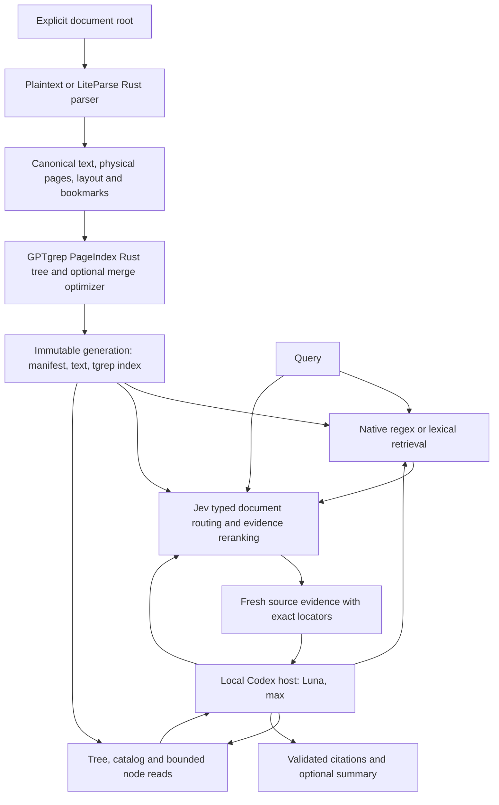

# GPTgrep architecture

English | [简体中文](architecture.zh-CN.md) | [日本語](architecture.ja.md)

GPTgrep gives a reasoning agent fast, inspectable access to local documents. It
keeps exact retrieval, probabilistic judgments, and model-written synthesis as
separate operations with separate receipts.
Jev routing and reranking are mandatory in default search and in the local
reasoning host. Exact primitives remain separately callable for inspection.

## Module ownership

| Crate/interface | Responsibility | External runtime |
| --- | --- | --- |
| `gptgrep-pageindex` | Pure Rust page/section coordinates, heading hierarchy, bookmark composition, structural optimization | None |
| `gptgrep-parse` | UTF-8 source preservation and source-pinned LiteParse translation | PDFium for native documents; LibreOffice for Office conversion |
| `gptgrep-index` | Embedded tgrep-core, conservative trigram candidates, exact Rust-regex verification | None; no daemon |
| `gptgrep-jev` | Choice/Noul/Score Decisions transport, schema validation, bounded inference | Explicit OpenRouter request |
| `gptgrep-core` | Snapshot publication, source freshness, retrieval composition and evidence contract | Required Jev for default hybrid and semantic retrieval |
| `gptgrep-host` | Bounded local Codex stdio app-server workflow, tool dispatch and final citation validation | Caller-selected Codex installation/account |
| `gptgrep-cli` | Native argv, JSON, schema and grep presentation | None for local commands |
| `packages/cli` | Optional incur presentation and discovery wrapper | Node and published incur 0.5.1 |

The host profile defaults are `model = "gpt-5.6-luna"` and
`model_reasoning_effort = "max"`, with `service_tier = "fast"`, as selected for this project. They are local
helper settings; they do not change the development agent's model. Runtime
`CODEX_HOME` selects an existing Codex configuration and authentication directory. The program does not read/copy auth
files, change global profiles, or perform an interactive login.

## Ingestion and snapshot consistency

The corpus root is explicit. Normal ignore rules apply even outside a Git repo;
hidden entries, Git/runtime/build directories, credential filenames, private keys,
and symlinked source entries are excluded. Source paths remain inside the corpus.
Native parsing must cover every physical page. Missing dependencies, extraction
errors and textless scans with OCR disabled are errors, rather than successful
empty documents. Empty plaintext is a valid document with no evidence spans.

The writer holds an OS file lock. It creates a unique generation under
`.gptgrep/generations/`, reads and hashes source bytes, parses, then rechecks the
source digest. It writes canonical text and a typed source manifest, builds a
trigram index, verifies completeness, and atomically publishes `CURRENT.json`.
A failed build leaves the prior pointer unchanged. Old generations are retained;
automatic deletion is outside the index operation.

The pointer binds the manifest digest and generation. The manifest binds canonical
root, document IDs, source/text digests, parser identity, pages and nodes. Readers
reject duplicate identities, malformed spans/hierarchy and incompatible schemas.
The index adapter separately binds its file table and candidate text digests.
These checks detect accidental corruption; an index is not a cryptographically
authenticated artifact from an unknown third party.

`source_fresh=true` on a hit means its original source bytes matched the recorded
digest when checked for that retrieval. Selected sources are checked again after
remote inference. It is not a promise that every filesystem entry has been newly
discovered. `status` verifies existing indexed documents; `index` discovers added
files and establishes a new corpus snapshot. Negative searches refer to that
snapshot and must be interpreted with coverage/stale warnings.

## Retrieval modes

**Hybrid is the default.** The default workflow requires Jev routing and
reranking and rejects missing credentials or inference errors. The explicit regex
and lexical modes are local primitives, including for controlled ablations.
They are not a fallback after Jev failure. Parsing and snapshot publication are
deterministic local stages; this release does not claim model-assisted indexing.

An optional exact document path scopes both trigram candidates and Jev routing
before any candidate limit. The report binds `document_scope`; `indexed_files`
counts the corpus while `scoped_files` counts the requested search scope.
Unknown or non-normalized paths are errors, rather than a silent whole-corpus search.

**Regex** uses tgrep's conservative trigram plan followed by matching the same
regex against original canonical UTF-8 lines. MatchAll plans scan candidates;
they never mean no hits. Unicode case folding and UTF-8 BOM handling require
conservative candidate expansion. Literal queries are escaped before planning.
The default context is zero, matching grep; callers request more with `-C`.

**Lexical** finds query-token matches using the same index, groups evidence by
tree node, and orders it by term coverage. This score is a local lexical measure,
not an embedding distance or calibrated semantic probability.

**Hybrid** retains lexical candidates and adds a separate semantic tree lane.
Jev first judges bounded document descriptions containing paths, headings and
opening text. Selected document leaf nodes contribute evidence independently of
query-token overlap. A second, per-candidate Score pass orders the bounded union.
**Semantic** uses that tree lane without a lexical seed. Initial routing examines
at most 32 document descriptions and the final pass at most 24 candidates; this is
an explicit development budget, not exhaustive semantic search over a large corpus.
Coverage reports expose the inspected scope and truncation. Hierarchical corpus
routing and resumable expansion are subsequent scalability work.

Choice scores compare available options, so they are not used as absolute
relevance. The reranker applies the same concrete Score rubric independently to
each candidate, normalizes its expected level to 0..1, and retains optional
confidence. Neither score nor confidence proves truth. An omitted candidate cannot
be recovered by reranking. No confidence-based abstention threshold is presented
as calibrated until held-out evaluation establishes it.

The initial explicit relevance floor is 0.5 of the ordered rubric, an operational
selection policy. In hybrid mode exact atomic-token matches remain available via
the lexical lane and are marked `literal_anchor`; the model score is not rewritten.
This avoids allowing an uncertain semantic judgment to erase a proven grep match.
No-answer cases, literal queries and natural-language questions are separate evals.

Jev uses `/api/alpha/decisions`, a 20-second request deadline, no automatic retry,
no redirects or provider fallback, at most 64 questions and a 64 KiB payload.
Malformed, missing, duplicate and mismatched responses fail explicitly. Returned
model and available usage/cost are retained; unavailable metrics remain null.

## Evidence and programmatic composition

Hits contain source-relative path, node ID, source SHA-256, physical page range,
line range, exact canonical UTF-8 byte interval, column offset, truncation flag,
score, citation and freshness. Plaintext byte/line coordinates refer to original
UTF-8 source. PDF/Office coordinates refer to canonical extracted text plus
physical source pages. Printed page labels are not substituted for physical pages.

Long snippets are bounded around the match instead of truncating preceding
context and losing the match. Text byte intervals preserve CRLF and Unicode.
The core precomputes line offsets once per document and stops formatting after
the requested regex result count, so output limits also bound presentation work.
Node reads provide `node_offset` and `next_offset` for bounded continuation.
Each delivered window is revalidated at its exact offset and length; native grep
context that crosses a node boundary retains its context and has no node cursor.

The native CLI is the canonical grep interface. Its optional incur wrapper passes
typed JSON requests to native argv without shell interpolation. MCP, updater and
skill-sync entry points are rejected before incur dispatch. `--schema` and
`--llms` expose a small discoverable programmatic contract.

## Local PageIndex-style reasoning

The local host uses Codex's stdio app-server, not a PageIndex cloud account and
not an MCP server. It exposes a bounded set of GPTgrep evidence operations to the
model. The caller owns question, root, timeout, tool-call budget and account home.
By default, the host performs initial Jev hybrid retrieval before starting the reader, then
supplies the bounded issued evidence in the first prompt. This stage cannot be
skipped by choosing a tree or read tool. Summaries constrain it to the selected
node's document. Subsequent searches default to hybrid. The host retains per-search
Jev coverage and usage alongside Codex usage, and the overall deadline includes
initial retrieval. Empty or stale scopes do not establish successful reranking.
Summary and retrieval use actual source evidence; model-produced citations must
resolve to evidence issued during that run and remain fresh at completion.

Authentication, source retrieval, inference, citation validation and task
acceptance are separate outcomes. A successful child process is insufficient.
The host reports actual thread/turn identity, effective model/effort, tool calls,
usage when supplied, and final validation. These runtime identities remain private
when results are used in project delivery receipts.

## Flash rewrite boundary

The raw Flash pipeline has substantial character/font/layout repair, multilingual
heading detection, outline validation, bookmark tiers and optional model passes.
LiteParse layout is currently an alternate geometry front end. The Rust tree and
merge stages carry explicit source mappings and tests; identical JSON shape alone
does not establish algorithm parity. Local Codex summaries and reasoning replace
the corresponding agentic service role, while Flash extraction parity remains a
separate stage-by-stage differential evaluation. See the source research and
crate notices for implemented stages and remaining differences.

## Experimental query planning

The default-off ask option `--experimental-query-plan` inserts one separate
Luna/max/fast completion before initial retrieval. The planner receives only the
original question, fixed scope and bounded source-derived descriptors. It can
propose zero to two retrieval phrases, never a new scope or citable evidence.
The original question remains unchanged.

Core collection pins one generation and overlaps at most two document-routing
operations. It keeps distinct windows in a node, deduplicates exact source spans,
and selects a stable round-robin union capped at 24 candidates. One final Jev
pass evaluates that union against the original question. Only original-view
literal anchors can bypass the relevance floor. The host owns evidence issuance
and applies the existing output cap before citations become available.

This is parallel independent first-hop retrieval; later dependent hops still use
the existing reader loop. Planner and reader share one absolute deadline, and
planner/branch failures are explicit. Per-operation Jev receipts and separate
model-attempt records retain identities, usage and unknowns on failures. Parent
totals do not add nested totals twice; legacy `usage` covers only the final reader.
Extra planning/routing work and candidate displacement are measured treatment
costs. This feature makes no indexing, multi-reader voting or quality claim.
