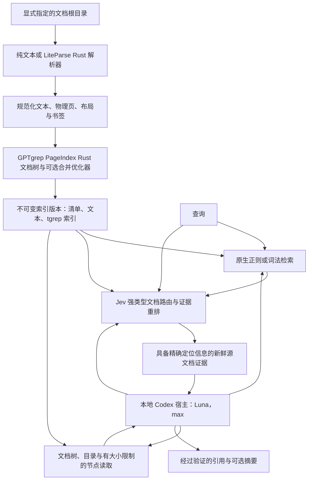

# GPTgrep 架构

[English](architecture.md) | [简体中文](architecture.zh-CN.md) | [日本語](architecture.ja.md)

GPTgrep 为推理智能体提供快速、可核查的本地文档访问能力。
精确检索、概率性判断和模型生成的综合结果是彼此独立的操作，各自保留独立回执。
默认搜索和本地推理宿主必须使用 Jev 路由与重排。精确检索原语仍可单独调用，用于检查。

## 模块职责

| Crate／接口 | 职责 | 外部运行时 |
| --- | --- | --- |
| `gptgrep-pageindex` | 纯 Rust 的页／节坐标、标题层级、书签组合与结构优化 | 无 |
| `gptgrep-parse` | 保留 UTF-8 源文本，并通过固定源码版本的 LiteParse 进行转换 | 原生文档需要 PDFium；Office 转换需要 LibreOffice |
| `gptgrep-index` | 内嵌 tgrep-core、保守的 trigram 候选生成、精确的 Rust-regex 验证 | 无；不使用守护进程 |
| `gptgrep-jev` | Choice/Noul/Score Decisions 传输、schema 校验、受预算约束的推理 | 显式发起的 OpenRouter 请求 |
| `gptgrep-core` | 快照发布、源文件新鲜度、检索组合与证据契约 | 默认 hybrid 与 semantic 检索必须使用 Jev |
| `gptgrep-host` | 受限的本地 Codex stdio app-server 工作流、工具分发与最终引用验证 | 由调用方选择的 Codex 安装与账户 |
| `gptgrep-cli` | 原生命令行参数、JSON、schema 与 grep 结果展示 | 本地命令无需额外运行时 |
| `packages/cli` | 可选的 incur 展示与接口发现包装层 | Node 和已发布的 incur 0.5.1 |

宿主配置的默认值为本项目选定的 `model = "gpt-5.6-luna"` 和
`model_reasoning_effort = "max"`，以及 `service_tier = "fast"`。这些设置仅用于本地辅助模型，不会改变开发智能体的模型。
运行时的 `CODEX_HOME` 用于选择已有的账户隔离环境。
程序不读取或复制认证文件、不修改全局配置，也不执行交互式登录。

## 文档摄取与快照一致性

文档集合的根目录必须显式指定。即使目录不在 Git 仓库中，常规忽略规则也仍然生效；
隐藏条目、Git／运行时／构建目录、凭据文件名、私钥和以符号链接指向的源文件条目均被排除。
源文件路径始终限制在文档集合内部。原生解析必须覆盖每个物理页。
缺少依赖、提取错误，以及在关闭 OCR 时遇到无文本层扫描文档，均视为错误，而非成功解析出的空文档。
空的纯文本文件是有效文档，但不包含任何证据区间。

写入方持有操作系统文件锁，在 `.gptgrep/generations/` 下创建唯一的索引版本，
读取源文件字节并计算摘要值，完成解析后再次检查源文件摘要值。
随后写入规范化文本和强类型源文件清单，构建 trigram 索引，验证完整性，并以原子方式发布 `CURRENT.json`。
构建失败时，原有指针保持不变。旧索引版本会保留；自动删除不属于索引操作的职责。

指针绑定清单摘要值与索引版本。清单绑定规范化的根目录、文档 ID、源文件／文本摘要值、
解析器身份、页和节点。读取方会拒绝重复身份、无效的区间或层级，以及不兼容的 schema。
索引适配器还会独立绑定文件表与候选文本摘要值。这些检查用于发现意外损坏；
它们并不意味着来自未知第三方的索引已通过密码学身份认证。

命中结果中的 `source_fresh=true` 表示：在本次检索的检查时刻，原始源文件字节与记录的摘要值一致。
远程推理结束后，还会再次检查已选中的源文件。这不保证文件系统中的每个条目都刚刚被重新发现。
`status` 验证已经索引的文档；`index` 发现新增文件，并建立新的文档集合快照。
没有匹配的搜索结果仅针对该快照成立，必须结合覆盖范围和过期警告来解读。

## 检索模式

**Hybrid 是默认模式。** 默认工作流必须执行 Jev 路由和重排，缺少凭据或推理失败会明确报错。
显式的 regex 和 lexical 模式是本地检索原语，也可用于受控消融实验；它们不会成为 Jev 失败后的回退路径。
解析和快照发布是确定性的本地阶段；本版本不声称已经实现模型辅助索引。

可以用一个精确的文档路径，在任何候选上限生效前同时约束 trigram 候选与 Jev 路由。
报告绑定 `document_scope`；`indexed_files` 统计整个文档集合，`scoped_files` 统计本次指定的检索范围。
未知或未规范化的路径会报错，不会静默扩大到整个文档集合。

**Regex** 先使用 tgrep 的保守 trigram 计划，再以同一个正则表达式逐行匹配原始规范化 UTF-8 文本。
MatchAll 计划表示需要扫描候选项，绝不表示没有命中。
Unicode 大小写折叠和 UTF-8 BOM 处理需要保守地扩大候选范围。
字面量查询会在规划前进行转义。默认上下文为零，与 grep 一致；调用方可用 `-C` 请求更多上下文。

**Lexical** 使用同一个索引查找查询词元匹配，按树节点归集证据，并根据词项覆盖率排序。
该分数是本地词法指标，不是嵌入向量距离，也不是经过校准的语义概率。

**Hybrid** 保留词法候选，并增加一条独立的语义树检索路径。
Jev 首先判断受长度限制的文档描述，其中包含路径、标题和开头文本。
所选文档的叶子节点会独立提供证据，不以查询词元是否重合为前提。
随后，第二次逐候选 Score 判断对这个受预算限制的候选并集排序。
**Semantic** 仅使用这条树检索路径，不需要词法候选作为起点。
初始路由最多检查 32 个文档描述，最终一轮最多检查 24 个候选；这是显式的开发预算，
并非对大规模文档集合进行穷尽式语义搜索。覆盖报告会展示实际检查的范围及截断情况。
分层文档集合路由和可续接的扩展仍属于后续扩展性工作。

Choice 分数用于比较可用选项，因此不被用作绝对相关性。
重排器对每个候选独立应用同一套明确的 Score 评分规则，将预期等级归一化到 0..1，
并保留可选的置信度。分数和置信度都不能证明内容真实。
未进入候选集的内容无法靠重排补回。在留出集评估完成校准验证之前，
不会将基于置信度的弃答阈值描述为已经校准。

初始的显式相关性门槛为有序评分规则上的 0.5，这是运行时的选择策略。
在混合模式下，单个完整词元的精确匹配仍可通过词法路径返回，并标记为 `literal_anchor`；
模型分数不会被改写。这样可避免不确定的语义判断抹去已经验证的 grep 匹配。
无答案案例、字面量查询和自然语言问题分别进行评估。

Jev 使用 `/api/alpha/decisions`，请求时限为 20 秒；不自动重试、不跟随重定向，也不回退到其他提供方。
每次请求最多包含 64 个问题，载荷上限为 64 KiB。
格式错误、缺失、重复或不匹配的响应都会明确失败。
实际返回的模型及可获得的用量／费用会被保留；不可获得的指标保持为 null。

## 证据与程序化组合

命中结果包含相对源文件路径、节点 ID、源文件 SHA-256、物理页范围、行范围、
精确的规范化 UTF-8 字节区间、列偏移量、截断标记、分数、引用及新鲜度。
纯文本的字节与行坐标对应原始 UTF-8 源文件。PDF／Office 的坐标对应规范化提取文本，
并附带源文档的物理页号。不会用印刷页码标签替代物理页号。

较长片段会以匹配位置为中心限制大小，避免只截取前面的上下文而丢失匹配本身。
文本字节区间保留 CRLF 和 Unicode。核心模块对每个文档只预先计算一次行偏移量，
达到请求的正则结果数后便停止格式化，因此输出限制也约束了结果展示所需的工作量。
节点读取提供 `node_offset` 和 `next_offset`，用于分次续读。
每个已返回的窗口都会按其精确偏移量和长度重新验证；原生 grep 的上下文若跨越节点边界，
会保留该上下文，但不提供节点游标。

原生 CLI 是标准 grep 接口。可选的 incur 包装层将强类型 JSON 请求转换为原生命令行参数，
不经过 shell 插值。MCP、更新器和 Skill 同步入口会在 incur 分发前被拒绝。
`--schema` 和 `--llms` 提供精简、可发现的程序化接口契约。

## 本地 PageIndex 风格推理

本地宿主使用 Codex 的 stdio app-server，不依赖 PageIndex 云账户，也不是 MCP 服务器。
它向模型提供一组数量和范围受限的 GPTgrep 证据操作。
问题、根目录、超时时间、工具调用预算和账户主目录均由调用方指定。
默认模式在启动回答 worker 之前先执行初始 Jev 混合检索，再将有大小限制且已登记的证据放入首条提示。
模型无法通过选择树或读取工具跳过这一阶段。摘要会将该阶段限制到所选节点所属的文档。
后续搜索默认使用 hybrid。宿主在 Codex 用量之外，保留每次 Jev 搜索的覆盖范围与用量，
总时限也包括初始检索。空范围或仅包含过期源的范围不能证明重排成功。
摘要与检索使用真实的源文档证据；模型生成的引用必须能够解析到本次运行实际返回过的证据，
且在完成时仍保持新鲜。

认证、源文档检索、推理、引用验证和任务验收是独立的结果状态。
子进程成功退出不足以证明任务已完成。宿主会报告实际的线程／轮次身份、
生效的模型／推理强度、工具调用、可获得的用量，以及最终验证结果。
当这些结果用于项目交付回执时，运行时身份信息仍保持私有。

## Flash 重写的边界

原始 Flash 流水线包含大量字符／字体／布局修复、多语言标题检测、目录树验证、书签分级，
以及可选的模型处理阶段。目前 LiteParse 布局是替代的几何信息前端。
Rust 的树与合并阶段具有明确的源代码映射和测试；仅仅生成相同结构的 JSON，不能证明算法等价。
本地 Codex 的摘要与推理承担对应的智能体服务职责；Flash 提取算法的等价性仍须单独逐阶段进行差分评估。
已实现阶段及尚存差异见本地源代码研究记录和各 crate 的许可证／来源说明。

## 可选的推理索引增强

`index` 不调用模型，先发布确定性的 LiteParse／文档树／tgrep 索引。显式 `enrich` 随后
沿来源绑定的 UTF-8 字节游标遍历每份已收录文档。零模型计划固定所有窗口和最坏调用预算；
live Codex（builder 默认 `gpt-6-luna`）提出小型封闭 schema 提示，Jev 对准确的原文
锚点进行支持判别。构建器和 Jev 使用独立持久账本；安全的预算暂停后可复用已验证的完整窗口。
未完成工作不会发布有效 overlay。完整 overlay 通过独立原子指针绑定原索引代际及来源字节。
提示仅用于导航，不改写树坐标，也不获得引用权。普通 `ask` 不读取该 overlay。限定文档且启用
规划的 `ask` 可以显式要求精确的 overlay SHA。宿主在规划器调用之前验证 overlay 和来源，
扫描全部合格的 Chunk/Node 提示，预先准备所有有上限的 Jev Score 批次；若总预算不足，
整个扫描直接失败。全局合并后最多向规划器与回答 worker 提供八条完整提示（合计 8 KiB）。
二者收到相同的非可信导航数据；只有正常 search/read 操作可以发放可引用证据。Jev 的部分
失败会明确报错并保留调用账目。集成完成本身不代表质量收益已经得到 live 证明。

新的增强计划可声明 `--support-retries 0..2`。仅对 Jev 超时、传输或瞬时 HTTP 失败，
整个账本最多追加两次相同已准备请求；每次有独立的持久预约、回执、有限退避，未知费用仍为
未知。默认值为零，旧计划摘要保持不变。终端失败的 builder／支持判别窗口只能显式用
`--resume --rebuild-failed-window CALL_ID` 继续：已完成窗口和失败回执保留，失败窗口的
builder 是**新的**模型样本，不能宣称重放了旧版未保留的 Jev 请求。每份账本最多允许两次
重建准入。这两种机制都不会重新抽取已经完成的答案。

## 实验性查询规划

默认关闭的 ask 选项 `--experimental-query-plan` 在初始检索前默认增加一次独立的
`gpt-6-luna`/调用方选择的推理强度/fast 补全（推理强度默认仍为 max）。
可用 `--planner-model` 显式选择规划模型；最终 reader
保留其独立指定的配置。规划器只接收原问题、固定范围和有上限的源文档描述，可提出零到两条
检索表述。它不能改变范围或产生可引用证据，原问题始终保持不变。

核心层固定同一索引版本，最多同时执行两路文档路由。同一节点中的不同窗口仍分别保留，
相同来源的相同字节跨度去重，按稳定轮转顺序选出最多24个候选。最后一次 Jev 调用按原问题
评估整个候选集合；只有原查询产生的 literal anchor 可以绕过相关性下限。宿主单独负责
证据发放，并在引用可用之前应用原有输出字节上限。

这里并发的是独立首跳检索，后续依赖前一步结果的检索仍由原有 reader 循环执行。规划和
回答共享同一个绝对截止时间，规划或分支失败会明确报错。各 Jev 阶段与模型 attempt
分别保留身份、用量和失败时的未知值；汇总不重复相加父子记录，旧的 usage 仅计最终 reader。
额外规划/路由调用以及候选替换都是需要实测的代价。本功能不声明新增模型索引、多 reader
答案投票或质量收益。

`--experimental-source-continuation` 是另一个默认关闭、仅用于单文档规划式 `ask` 的选项。
它只给 reader 增加指导：当请求的事实或关系在节点边界仍未解决时，利用已验证的树与读取工具
检查相邻节点；`next_offset = null` 仅代表当前节点结束，不代表来源调查完成。未发放文本
不能成为引用，也不增加工具、时间或输出预算。报告绑定选项与指导摘要；关闭时 reader 指令
字节保持不变。质量作用仍需单独冻结的全量 cohort 消融验证。

## 实验性证据角色

仅 ask 支持的 `--experimental-evidence-roles` 默认关闭，并要求启用查询规划。统一候选
请求中，每个确切源窗口保留原有相关性 Score，并增加一个四选一 Choice，仍使用同一次必需
Jev 请求。24 个候选最多产生 48 个问题；硬上限仍为 64 个问题和 65,536 个编码请求字节。
共享角色定义不超过 2,048 字节。准入检查完整请求（包括转义和元数据），超限明确失败。

候选资格和原查询 literal anchor 的保留规则不变。符合条件的窗口依次按原始 anchor 分组、
角色（`direct_support`、`source_local_incomplete`、`background`、`no_support`）、相关性降序
和稳定来源坐标排序。直接支持只表示至少一个所问事实可用，不证明所有约束或后续答案已被
支持。交付集合的充分性始终为未评估。现有有界读取工具可以补齐局部片段，不引入隐藏读取
或额外模型步骤。

判断绑定 generation、路径、来源哈希、字节区间、正文哈希以及原问题和判断合同哈希。主机在
按完整 hit 打包后发放证据。区间或正文哈希发生变化时，交付窗口的角色提示失效，原判断范围
与实际交付范围分别记录。角色 confidence 和可选分布保留在诊断元数据中，不替换相关性
confidence。未交付字节不能引用。

最多 24 条私有候选判断记录保存资格、得分、角色、排序及实际舍弃／交付原因；共享来源表，
不包含源正文。编码诊断块不超过 24 KiB，同时满足现有 ledger 单条、事件数和总字节上限。
预留或持久化失败须明确报告。被拒绝候选的记录不进入回答上下文，也不授予引用权限。问题
数量、请求和判断合同哈希、用量与成本归属同一次统一操作；即使请求次数不变，额外问题也
可能增加 token 与延迟。原有相关性路径保留为声明的对照，必需 Jev 阶段及调用方预算不变。
